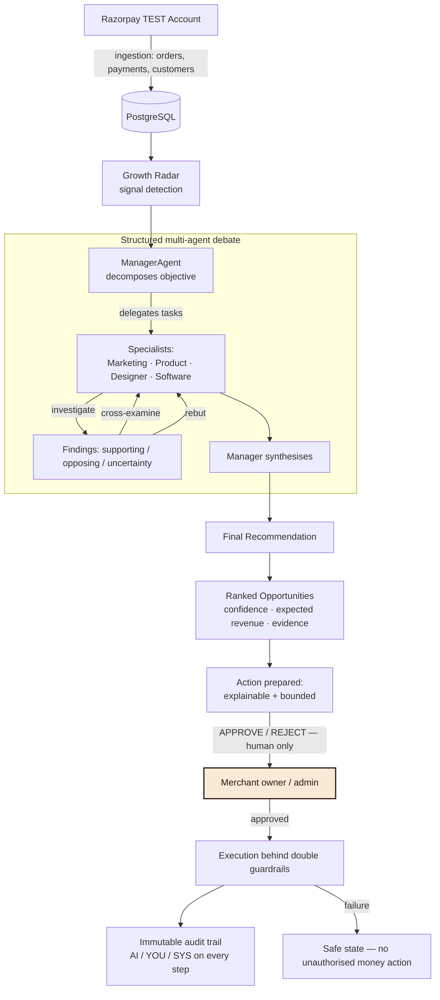
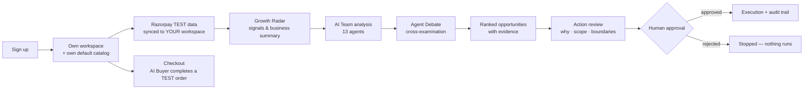

<div align="center">

# 🚀 RazorGrowth AI

### **Your AI Growth Team for Razorpay — it finds the revenue, explains the why, and waits for your approval.**


**RazorGrowth AI ingests a merchant's real Razorpay TEST-mode business data, runs a team of 13 specialised AI agents over it, debates the findings, and turns the strongest opportunity into a bounded, explainable, human-approved action — with an immutable audit trail on every step. It also includes an AI Buyer that reads the merchant's catalog and completes a genuine Razorpay TEST purchase end-to-end.**

*Every number is real. Every money action is explained, bounded, gated by human approval, and auditable.*

<br>


</div>

---

## 📖 What is RazorGrowth AI?

Merchants on Razorpay have real data — successful payments, failed payments, repeat customers, product catalogs — but no systematic way to turn it into decisions. RazorGrowth AI is the decision layer between raw commerce data and action:

> **Data in → AI team analyses → agents debate the evidence → you approve → the system executes → every step is audited.**

The system is built like a company staffed with AI employees: a Growth **Manager** who coordinates, four **specialists** (Marketing, Product, Design/UX, Technology) who investigate and cross-examine each other's findings, and a bench of eight **domain experts** (payment recovery, customer intelligence, revenue optimisation, campaign strategy, experimentation, growth memory, discovery, prioritisation). No single agent decides alone — important conclusions are reached through structured multi-agent debate, then gated behind human approval.

**Who it's for:** Razorpay merchants (TEST mode today) who want to know *what is happening in my business, why it matters, and what to do next* — without trusting a black box with their money.

---

## ✨ Core Features

### 📡 Growth Radar
A live business-health dashboard computed from real Razorpay TEST data — revenue captured, transactions, customers, orders, average order value, failed payments — followed by a **plain-English business summary generated from that data**, detected growth signals ranked by confidence, and the priority opportunity. Signals cover revenue change, repeat-purchase decline, payment failures, dormant customers, and unusual order behaviour. Missing data produces an honest empty state — never invented numbers.

### 🧠 AI Growth Team
Thirteen specialised agents (see the [AI Team](#-the-ai-team) table) execute a collaborative pipeline over the merchant's data: retrieve evidence → analyse → produce findings → create ranked opportunities with confidence and expected revenue → prepare recommendations. Agents hold a **capability model** that structurally forbids them from approving actions, bypassing guardrails, or touching money — they can only *propose*.

### ⚖️ Agent Debates
Specialist agents don't just report — they **cross-examine each other** across structured rounds (investigate → cross-examine → rebut → synthesise), with findings classified as *supporting / opposing / uncertainty* and the Growth Manager synthesising a final recommendation. A **Groq/LLM-powered chat assistant** on the debate page answers merchant questions ("why was this recommended?", "which agent contributed?") using only that debate's context.

### 🛡️ Actions & Human Approval
Every money-touching action is **explainable** (why it was recommended, evidence, scope, amount, who/what is affected), **bounded** (an explicit will-do / will-not-do list, guardrail amount ceilings, campaign audience limits, discount percentage caps), and **gated** — agents propose, but only a merchant **owner/admin** can approve or reject. Approved actions execute behind double guardrails with idempotency, and an **immutable audit trail** records every step with AI / YOU / SYS actor markers.

### 🤖 AI Buyer Checkout
An AI buyer reads the merchant's real catalog, selects a product at its real price, creates a Razorpay TEST order, and completes payment. **Success and failure are both honest** — the declined test card produces a real "payment could not be completed" safe state: no money captured, no automatic retry, a clear recovery path. Never a fabricated result.

### 🔐 Multi-Tenant Security
JWT authentication with scrypt password hashing, merchant-scoped roles (`owner / admin / operator / analyst`), and strict tenant isolation: every query is scoped to the authenticated user's workspace. Cross-tenant access returns `403`; logged-out requests return `401` — there is no anonymous fallback and no shared data. Razorpay records belong to exactly one workspace and are never copied across merchants.

### 🧮 Business Data Intelligence
Razorpay TEST ingestion (orders, payments, customers), a RAG knowledge store with pgvector embeddings, deterministic opportunity scoring (revenue potential × confidence × urgency × evidence strength), revenue-impact simulations with confidence bands, A/B experiment design, growth memory that learns from prior outcomes, and per-merchant customer intelligence (LTV, churn risk, payment success).

### 🔌 Multi-Provider LLM Layer
One provider abstraction — **OpenRouter (free models only) · Groq · OpenAI** — selected by a single `LLM_PROVIDER` setting. Free-model enforcement is in code: the OpenRouter provider refuses to construct unless the model id ends with `:free`; there is no paid fallback and no silent provider switch.

---

## 🧠 The AI Team

Populated from `backend/app/agents/registry.py` — 13 agents in two groups:

### Main Growth Team (runs the debate pipeline)

| Agent | Responsibility | Input | Output |
|---|---|---|---|
| **ManagerAgent** | Top-level coordinator — decomposes objectives, delegates, manages the debate, synthesises | Merchant RAG context, objective | Action plan, debate coordination, final synthesis |
| **MarketingAgent** | Customer segments, retention / win-back campaigns, messaging strategy | Customer intelligence, verified facts | Campaign recommendations with evidence |
| **ProductAgent** | Upsell / cross-sell discovery, product affinity, product strategy | Orders, order items, product catalog | Product growth opportunities with evidence |
| **DesignerAgent** | Campaign creatives, messaging, experiment variants, UX recommendations | Debate context, prior findings | Creative briefs for human approval |
| **SoftwareAgent** | Technical implementation planning, feasibility, integration requirements | Findings, action plan | Engineering specifications |

### Domain Specialists (support the analysis pipeline)

| Agent | Responsibility | Input | Output |
|---|---|---|---|
| **GrowthDiscoveryAgent** | Detects revenue, churn, and payment signals | Radar signals, commerce data | Deduplicated, scored opportunities |
| **CustomerIntelligenceAgent** | LTV, recency, frequency, payment success, churn risk | Customers, orders, payments | Segment metrics + churn-risk insights |
| **RevenueOptimizationAgent** | Ranks opportunities, proposes highest-impact bounded action | Open opportunities, scoring engine | Discount / campaign proposals |
| **CampaignStrategistAgent** | Designs campaigns (segment, objective, channel, offer) | Customer segments | Human-approved campaign actions |
| **PaymentRecoveryAgent** | Finds failed payments worth recovering, quantifies value | Failed payments | Retry actions (still require approval) |
| **OpportunityPrioritizationAgent** | Scores and ranks open opportunities | Deterministic scoring engine | Best-first opportunity queue |
| **ExperimentAgent** | Designs honest A/B experiments (control vs treatment) | Top opportunity | Experiments (pending until real data) |
| **GrowthMemoryAgent** | Remembers prior recommendations and outcomes | Past runs, memories | History that grounds new recommendations |

**Orchestration & persistence.** `GrowthAgentOrchestrator` executes a mode-specific plan (`fast` / `deep` / `team` / `growth_team`). Specialists share findings through a common context; debate turns are grounded by the configured LLM; every run is recorded in `agent_runs` (status, latency, provider, model, tools used, outputs). **Failure handling:** each agent runs inside a savepoint — a failed agent rolls back only its own work, its error is recorded, and the run reports `partial_success` when some agents succeed; a run only fails when every agent fails.

---

## ⚖️ How an Agent Debate Works



Every arrow is enforced in code: agents **cannot** approve (the capability model forbids it), approval endpoints are restricted to owner/admin roles, guardrails re-evaluate immediately before execution, and failed executions persist a safe-state audit event. Debate turns are real LLM reasoning grounded in the merchant's verified data — never canned responses.

---

## 👤 The User Journey



1. **Sign up** → a new user, a new workspace, one owner membership, and a 10-product default catalog — instantly
2. **Growth Radar** → real Razorpay TEST signals with a plain-English summary
3. **AI Team** → start an analysis; watch the agents run and persist findings
4. **Debates** → specialists cross-examine each other; the manager synthesises a recommendation
5. **Opportunities** → ranked with confidence, expected revenue, and evidence
6. **Actions** → inspect the prepared action: why, evidence, scope, and explicit boundaries
7. **Approve → Run** → execute and watch the audit trail record every step
8. **Checkout** → the AI Buyer reads your catalog and completes a Razorpay TEST order

---

## 🏛️ Architecture

```
┌────────────────────────────────────────────────────────────────────┐
│  FRONTEND — React 19 · TypeScript · Vite                          │
│  Home · Login/Signup · Growth Radar · AI Team · Debates          │
│  Growth Actions · AI Buyer Checkout · Profile                      │
└──────────────────────────────┬─────────────────────────────────────┘
                        REST /api + Bearer JWT
┌──────────────────────────────▼─────────────────────────────────────┐
│  BACKEND — FastAPI · SQLAlchemy 2.0 · Alembic                       │
│                                                                      │
│  ┌────────────┐ ┌───────────────┐ ┌──────────────────────────────┐  │
│  │ Radar      │ │ 13 AI Agents  │ │ Opportunity Engine           │  │
│  │ signals    │ │ + Debate      │ │ (scoring · ranking · sims)   │  │
│  └────────────┘ └──────┬────────┘ └──────────────────────────────┘  │
│  ┌─────────────────────▼─────────────────────────────────────────┐  │
│  │ Action layer: guardrails → human approval → executors           │  │
│  │              + immutable audit events                           │  │
│  └─────────────────────┬─────────────────────────────────────────┘  │
│  ┌─────────────────────▼─────────────────────────────────────────┐  │
│  │ LLM provider layer: OpenRouter (free-only) · Groq · OpenAI     │  │
│  └───────────────────────────────────────────────────────────────┘  │
└────────┬───────────────────────────────────────────────┬────────────┘
         │                                               │
   ┌─────▼──────────────┐                      ┌─────────▼───────────┐
   │ PostgreSQL 16      │                      │ Razorpay TEST APIs   │
   │ + pgvector (Docker)│                      │ orders · payments ·  │
   │ tenant-isolated    │                      │ customers            │
   └────────────────────┘                      └─────────────────────┘
```

**Tenant isolation is enforced at the data layer**: every merchant-owned query filters by the authenticated user's workspace, and the Razorpay ingestion carries a cross-tenant ownership guard so one workspace's checkout records can never be copied into another merchant's workspace.

---

## 🔌 Marketing Agent Integrations

The **Marketing Agent** is an autonomous employee that can research, plan, and prepare marketing campaigns — it needs connections to real external providers to execute. This section covers the integration layer.

### Provider Overview

| Provider | Key | Type | Connection | Write Actions (Approval-Gated) |
|---|---|---|---|---|
| **Email (Resend)** | `resend` | email | API key + verified sender | `send_email` (campaign) |
| **Google Ads** | `google_ads` | ads | OAuth2 (client + refresh token) + developer token | `create_campaign_paused` (PAUSED by default) |
| **Meta Ads** | `meta_ads` | ads | OAuth2 (app + access token) | `create_campaign_paused` (PAUSED by default) |
| **Instagram** | `instagram` | social | OAuth2 (same Meta app) | `publish_photo` |
| **CRM (Internal)** | `internal` | crm | — (tenant-scoped DB) | — |
| **Analytics (Internal)** | `internal` | analytics | — (tenant-scoped DB) | — |

### How It Works

1. **No fake connections** — a provider shows **CONNECTED** only after a successful live verification call against the real API. Nothing is marked connected just because a key exists.
2. **Secrets are encrypted at rest** — per-workspace credentials are stored as Fernet-encrypted blobs in the `integration_connections` table. The `INTEGRATION_CREDENTIAL_KEY` (or derived from `AUTH_SECRET_KEY`) encrypts them. Decrypted values exist only in memory, passed only to provider HTTPS calls, and are never returned by APIs, logged, or audited.
3. **Approval-gated writes** — the Marketing Agent can **read** live data (campaigns, metrics, accounts) autonomously when connected. **Writes** (`send_email`, `create_campaign_paused`, `publish_photo`) are **never** executed from agent tools. They run exclusively through the human-approved **Actions pipeline** (`/api/actions`):
   - Agent proposes → Human approves → Executor verifies connection live → Provider call → Audit event.
4. **Test mode** — when `EXECUTION_ENABLED=false` (default), write actions return an honest test-mode preview (`executed=false`, `mode="test"`) and **never** claim real delivery.
5. **Tenant isolation** — every connection row is bound to exactly one `merchant_id`. A user from Workspace A can never read or write Workspace B's connections.

### Connecting an Account (UI)

Open the **Marketing Agent** workstation (`/marketing-agent`), go to **Marketing Stack** → click the provider card:
- **Email (Resend)** — paste your Resend API key + verified sender email/name → "Connect + Verify" (live key check before storing).
- **Google Ads / Meta Ads / Instagram** — click "Connect with Google/Meta OAuth" (redirects to provider consent) **or** paste a long-lived access token + account ID → "Verify + Store Token" (live verification before storing).
- **Disconnect** — wipes the encrypted credentials, best-effort revokes the remote token, writes an audit event.

### API Endpoints

```
GET  /api/marketing-agi/integrations                 — list all providers + live status
GET  /api/marketing-agi/integrations/{provider}      — one provider detail
POST /api/marketing-agi/integrations/{provider}/connect  — connect (API key or OAuth code/token)
POST /api/marketing-agi/integrations/{provider}/test     — re-verify live
POST /api/marketing-agi/integrations/{provider}/disconnect — disconnect
GET  /api/marketing-agi/integrations/{provider}/oauth/start — OAuth URL + signed state
GET  /api/marketing-agi/integrations/{provider}/oauth/callback — provider redirect
GET  /api/marketing-agi/integrations/audit           — integration audit trail
```

All endpoints require authentication and enforce merchant-scoped access. The OAuth callback carries no `Authorization` header — the tenant comes from the HMAC-signed state token.

### Test Connection

Every provider implements a **Test Connection** button in the UI and a `/test` API. The result includes:
- `ok` (success/failure)
- `error_code` (structured, e.g. `AUTH_EXPIRED`, `RATE_LIMITED`, `INSUFFICIENT_PERMISSIONS`)
- `message` (human-safe, no secrets)
- `account` (safe identity: account name, id, last verified timestamp)

Example success:
```json
{
  "ok": true,
  "provider": "google_ads",
  "error_code": null,
  "message": "Google Ads verified (customer 111222).",
  "account": { "customer_id": "111222", "customer_name": "Acme Ads", "accessible_count": 3 },
  "verified_at": "2026-09-21T10:31:00Z"
}
```

Example failure:
```json
{
  "ok": false,
  "provider": "meta_ads",
  "error_code": "AUTH_EXPIRED",
  "message": "Meta authorization has expired. Reconnect the account.",
  "account": {},
  "verified_at": null
}
```

### Audit Trail

Every external integration action writes an `AuditEvent` (`entity_type="integration_connection"`) with a **redacted payload** — secrets are replaced with `***REDACTED***` before persisting. Event types:
- `integration_connected` / `integration_disconnected`
- `integration_connection_verified` / `integration_connection_failed`
- `integration_action_executed` / `integration_action_failed`

### Required Environment Variables (Platform Defaults)

| Variable | Purpose |
|---|---|
| `RESEND_API_KEY` / `RESEND_FROM_EMAIL` / `RESEND_FROM_NAME` | Platform default Resend sender |
| `GOOGLE_OAUTH_CLIENT_ID` / `GOOGLE_OAUTH_CLIENT_SECRET` / `GOOGLE_OAUTH_REDIRECT_URI` / `GOOGLE_ADS_DEVELOPER_TOKEN` | Platform Google Ads app |
| `META_APP_ID` / `META_APP_SECRET` / `META_OAUTH_REDIRECT_URI` | Platform Meta/Instagram app |
| `INTEGRATION_CREDENTIAL_KEY` | Dedicated Fernet key (32-byte urlsafe base64). Empty = derived from `AUTH_SECRET_KEY` (dev only; production should set explicitly — startup logs a warning) |

Workspaces connect **their own** accounts via the UI — these platform defaults are only fallbacks when a workspace hasn't connected its own account.

### Security Notes

- **No credentials in Git / CI / Docker images / logs** — only variable names in `.env.example`.
- **Signed OAuth state** — 15-min TTL, HMAC-SHA256 over `merchant_id + provider + exp + nonce`, single-use nonces tracked in memory.
- **Error taxonomy** — structured codes (`ERR_AUTH_EXPIRED`, `ERR_RATE_LIMITED`, `ERR_ACCOUNT_NOT_FOUND`, etc.) surfaced to the agent/UI; never raw provider bodies or stack traces.
- **Google Ads** — requires developer token + `login-customer-id` when using a manager account; access tokens minted from stored refresh tokens; expired/revoked tokens return `AUTH_EXPIRED` / `AUTH_REVOKED` for honest reconnect UX.
- **Meta/Instagram** — shares the Meta OAuth app; long-lived tokens extended from short-lived codes; two-step publish (`media` → `media_publish`).

---

## 🛠️ Tech Stack

| Layer | Technologies |
|---|---|
| Backend | FastAPI, SQLAlchemy 2.0, Alembic, Pydantic v2, Pydantic-Settings |
| Database | PostgreSQL 16 + pgvector (Docker Compose) |
| Auth | JWT (PyJWT), scrypt password hashing, role-based multi-tenancy |
| Payments | Razorpay Python SDK (TEST mode, HMAC-SHA256 signed webhooks) |
| LLM | OpenRouter (free-only) / Groq / OpenAI via one provider abstraction |
| Frontend | React 19, TypeScript 5.7, Vite 6, custom editorial design system |

---

## ⚡ Quick Start

### Run the whole stack with Docker (recommended — one command)

**STEP 1 — Get the project** into a completely fresh folder. Either clone it:

```bash
git clone https://github.com/Jrdheeraj/RazorGrowth-AI.git
```

or download it as a ZIP from GitHub (`Code` → `Download ZIP`) and extract it.

**STEP 2 — Open the project folder** in a terminal:

```bash
cd RazorGrowth-AI
```

(If you downloaded the ZIP, `cd` into the extracted folder instead.)

**STEP 3 — Make sure Docker Desktop is installed and running.** Install it
from [docker.com](https://www.docker.com/products/docker-desktop/) if needed,
then start it and wait until it reports as running — nothing below works
while Docker is stopped.

**STEP 4 — Start the complete application** with one command:

```bash
docker compose up --build
```

That single command starts **everything** — no manual database setup, no
manual migrations:

1. **PostgreSQL 16 + pgvector** starts in a container (named volume
   `postgres_data`, health-checked)
2. The **backend** container waits for the database healthcheck, runs
   `alembic upgrade head` automatically (idempotent — safe on every
   restart), then starts FastAPI on port **8001**
3. The **frontend** builds with Vite and is served by nginx on port **5173**
   (same origin — nginx proxies `/api/*` to the backend, so no CORS setup)

What happens on a fresh start:

```
Fresh project
↓
Docker Compose starts PostgreSQL + pgvector
↓
Database becomes healthy
↓
Alembic migrations run automatically
↓
Backend starts
↓
Frontend starts
↓
Open the application at http://localhost:5173
```

No manual PostgreSQL setup, no `alembic upgrade head`, no separate
`uvicorn` or `vite` commands — the Compose startup handles all of it.

Then open **http://localhost:5173** and sign up — signup creates **your own
workspace with its own 10-product default catalog**, so Checkout works
immediately without any Razorpay connection.

**Configuration:** no `.env` file is needed for a fresh run — Compose ships
working defaults for everything (database, ports, a local-only JWT signing
key), so the commands above are enough on their own. Only create one if you
want to change something:

```bash
cp .env.example .env
# edit .env — keep it private, never commit it
# required: AUTH_SECRET_KEY (>=32 random chars)
# optional: Razorpay TEST keys, LLM keys, Resend / Google Ads / Meta — see below
docker compose up -d
# after any .env change: docker compose down && docker compose up --build
```

Marketing Agent integrations are configured in the same `.env` — copy
`.env.example`, fill only the providers you use, keep
`EXECUTION_ENABLED=false` until you are ready for real external writes.
Without provider credentials the backend still starts; the Marketing Agent
simply reports those integrations as **NOT CONNECTED**. See
[Marketing Agent Integrations](#-marketing-agent-integrations) for
per-provider setup and the [Environment Variables](#-environment-variables)
table for the full list.

| URL | What |
|---|---|
| `http://localhost:5173` | Frontend (the application) |
| `http://localhost:8001/docs` | Backend API docs (interactive Swagger UI) |
| `http://localhost:8001/api/health` | Backend health check |
| `localhost:5432` | PostgreSQL (internal, persistent volume) |

**Stopping:** `docker compose down` (stops the containers; the database
volume survives, so your data is still there on the next `up`).
**Resetting the database:** `docker compose down -v` — removes the
`postgres_data` volume (this **deletes all local database data**); the next
`docker compose up --build` recreates the database and runs the migrations
again automatically.

**Troubleshooting**

| Symptom | Fix |
|---|---|
| Docker Desktop is not running (`Cannot connect to the Docker daemon`) | Start Docker Desktop and wait until it shows as running, then retry |
| `port is already allocated` (5432/5173/8001 busy) | Change `POSTGRES_PORT` / `FRONTEND_PORT` / `BACKEND_PORT` in `.env` |
| Backend exits with migration error | Run `docker compose logs backend` — the error is printed and the container stops (never silently broken) |
| `razorgrowth-db` unhealthy | Run `docker compose logs db`; if a stale volume is corrupted: `docker compose down -v` (destroys local data) then `up` again |
| pgvector missing | The image `pgvector/pgvector:pg16` ships pgvector pre-installed; `CREATE EXTENSION IF NOT EXISTS vector` runs in the first migration |

### Local development (without Docker for the app code)

Prerequisites: Python 3.11+ · Node.js 18+ · Docker

```bash
# 1 — PostgreSQL only (Docker)
docker compose up -d db        # PostgreSQL 16 + pgvector on :5432

# 2 — Backend
pip install -r requirements.txt
cp .env.example .env           # then fill in the values from the table below
alembic upgrade head           # create the schema
uvicorn backend.app.main:app --host 127.0.0.1 --port 8001

# 3 — Frontend
cd frontend
npm install
npm run dev                    # http://localhost:5173 (Vite proxies /api → :8001)
```

### Create your account
Open `http://localhost:5173/login` and sign up — signup creates **your own workspace with its own 10-product default catalog**, so Checkout works immediately without any Razorpay connection.

<details>
<summary><b>Optional — bootstrap an admin on an existing workspace</b></summary>

```bash
python -m backend.app.data.bootstrap_admin --email <email> --password '<12+ chars, letter+digit>'
```
</details>

<details>
<summary><b>Optional — seed the deterministic demo dataset</b></summary>

Set `SEED_DEMO_DATA=true` in `.env` (or run `python -m backend.app.data.seed`
locally). Creates a demo merchant with 10 products, 60 customers and 240
orders — idempotent, safe to re-run.
</details>

---

## 🔧 Environment Variables

Copy `.env.example` to `.env` only to override defaults (optional — Docker
Compose runs with safe defaults and no `.env` file). **Variable names only** — never commit real secrets.
Keep `.env` private (`git` already ignores it); `EXECUTION_ENABLED` stays
`false` during setup and you restart Docker after any `.env` change.

| Variable | Purpose |
|---|---|
| `DATABASE_URL` / `POSTGRES_*` / `BACKEND_PORT` / `FRONTEND_PORT` | Database + Compose ports |
| `AUTH_SECRET_KEY` | JWT signing key (≥ 32 chars) — **required** |
| `INTEGRATION_CREDENTIAL_KEY` | Fernet key for encrypted workspace credentials (empty → derived from `AUTH_SECRET_KEY`; set explicitly in production) |
| `EXECUTION_ENABLED` | Global kill switch for real external writes — keep `false` until ready |
| `RAZORPAY_KEY_ID` / `RAZORPAY_KEY_SECRET` | Razorpay **TEST** credentials |
| `RAZORPAY_ENABLED` / `RAZORPAY_TEST_MODE` / `REAL_TEST_INTEGRATION_ENABLED` | TEST-mode switches |
| `RAZORPAY_WEBHOOK_SECRET` | Webhook signature validation |
| `LLM_PROVIDER` | `openrouter` \| `groq` \| `openai` |
| `OPENROUTER_API_KEY` / `OPENROUTER_MODEL` | OpenRouter — model id **must** end in `:free` (enforced in code) |
| `GROQ_API_KEY` / `GROQ_MODEL` | Groq configuration |
| `LLM_API_KEY` / `LLM_MODEL` | OpenAI configuration |
| `RESEND_API_KEY` / `RESEND_FROM_EMAIL` / `RESEND_FROM_NAME` | Email — Resend platform default (per-workspace keys via UI are preferred) |
| `GOOGLE_OAUTH_CLIENT_ID` / `GOOGLE_OAUTH_CLIENT_SECRET` / `GOOGLE_OAUTH_REDIRECT_URI` / `GOOGLE_ADS_DEVELOPER_TOKEN` / `GOOGLE_ADS_API_VERSION` | Google Ads platform OAuth + developer token |
| `META_APP_ID` / `META_APP_SECRET` / `META_OAUTH_REDIRECT_URI` / `META_GRAPH_VERSION` | Meta Ads / Instagram platform OAuth |
| `GUARDRAIL_MAX_AMOUNT_INR` / `GUARDRAIL_REQUIRE_APPROVAL` | Money-action guardrails |
| `CORS_ORIGINS` / `TRUSTED_HOSTS` | Security middleware |

---

## 🧪 Development

```bash
pytest                        # backend suite (673 tests)
cd frontend && npm run build  # TypeScript check + production build
```

Tests run against an isolated SQLite schema with JSONB-compatible DDL — they never touch your PostgreSQL data. A small number of end-to-end tests exercise live LLM calls and may be skipped when the provider's rate limit window is active; they are not required for the core suite.

### Common setup issues

| Symptom | Cause / fix |
|---|---|
| `Database not initialised` on first request | Run `alembic upgrade head` before starting uvicorn (Docker path does this automatically) |
| `422` on signup | Password policy: ≥ 12 characters, at least one letter and one digit |
| Empty Radar on a new account | Expected until that workspace connects its own Razorpay data — the default catalog still powers Checkout |
| `RAZORPAY_CREATE_PAYMENT_LINK_FAILED` in logs | Razorpay TEST caps payment links at 30/day; checkout continues via the order id |
| LLM `429` responses | Provider rate limit — retry after the window; free models only, no paid fallback |

---

## 📁 Project Structure

```
RazorGrowth AI/
├── backend/app/
│   ├── agents/              # 13 specialised agents + orchestrator + registry
│   ├── ai/llm/              # provider layer: OpenRouter (free-only) · Groq · OpenAI
│   ├── api/routes/          # auth, radar, agents, debates, actions, payments, webhooks…
│   ├── core/                # config, security, middleware, secret-redacting logs
│   ├── data/                # deterministic seed, workspace bootstrap, admin tools
│   ├── integrations/        # Razorpay client (TEST-mode boundary, honest refusals)
│   ├── models/              # SQLAlchemy models (tenant-scoped)
│   ├── repositories/        # data-access layer
│   ├── schemas/             # Pydantic API contracts
│   └── services/           # radar, ingestion, actions, executors, scoring, debate…
├── frontend/src/
│   ├── components/          # WindowPanel, buttons, header (editorial design system)
│   ├── features/public/     # marketing sections + Agent Debate UI
│   ├── pages/               # Home, GrowthRadar, AgentsPage, DebatePage,
│   │                        # ActionsPage, Checkout, Login, Profile
│   ├── lib/                 # typed API client, auth context
│   └── styles/              # design tokens (cream / ink / terracotta)
├── migrations/versions/     # Alembic migrations (Phases 3–6 + alignment)
├── tests/                   # 673-test pytest suite
├── docker-compose.yml       # PostgreSQL 16 + pgvector + backend + frontend
├── backend/Dockerfile       # FastAPI image (runs migrations on startup)
├── frontend/Dockerfile      # Vite build + nginx (proxies /api to backend)
├── requirements.txt
└── .env.example             # annotated configuration template (blank secrets)
```

---

## 🎯 Hackathon Track: AI Growth & Agentic Commerce

Every claim below maps to shipped functionality:

| Track requirement | Where it exists |
|---|---|
| Real Razorpay TEST data | Genuine TEST-mode integration — orders created & verified on Razorpay endpoints, ingested per-merchant |
| AI agents | 13 specialised agents with a capability/permission model |
| Upsell & cross-sell | ProductAgent affinity analysis from real order items |
| Payment recovery | PaymentRecoveryAgent → bounded retry action for the highest-value failure |
| Campaign opportunities | CampaignStrategistAgent → human-approved campaign action |
| Agentic workflow | detect → analyse → debate → propose → approve → execute → audit |
| Human approval | Owner/admin-only approve & reject; agents structurally cannot approve |
| Explainable, bounded actions | Every action shows why, evidence, scope, amount, and will-do / will-not-do |
| Audit trail | Per-action timeline of every step, merchant-friendly rendering |
| Graceful failure | Checkout failure = honest safe state (no capture, retry path); execution failures persist a safe-state audit event |
| AI buyer commerce | AI Buyer reads the real catalog → real-price Razorpay TEST order → payment result |

### 10-minute demo flow
1. **Sign up** → your own workspace + default catalog appears instantly
2. **Growth Radar** → real Razorpay TEST signals with a plain-English summary
3. **Start AI analysis** → watch 13 agents run and persist findings
4. **Open the Debate** → read the cross-examination; ask the debate assistant a question
5. **Growth Actions** → inspect the prepared action: why, evidence, scope, boundaries
6. **Approve → Run** → execute and watch the audit trail record every step
7. **Checkout** → select a real product, create a Razorpay TEST order, pay with test card `4111 1111 1111 1111`
8. **Failure demo** → use a declined test card: the honest "payment could not be completed" safe state appears

---

## 🗺️ Roadmap

Items below are **not yet implemented** — recorded as direction only:

- Live Razorpay execution path (currently refused honestly behind feature flags)
- Multi-merchant agency view
- Automated A/B measurement on executed campaigns
- Streaming agent activity during debate rounds

---

## 🔒 Security & Safety

- **Fail-closed Razorpay boundary** — execution requires explicit enablement; live mode refuses honestly until deliberately implemented
- **Signed webhooks** — HMAC-SHA256 validation; unsigned deliveries are rejected
- **Secret-safe logging** — a log filter redacts every configured secret value
- **Rate limiting** — sliding-window limits on auth and webhook endpoints
- **Production fail-fast** — startup refuses weak JWT secrets / unsafe hosts
- **Guardrails everywhere** — amount ceilings, approval gates, idempotent execution, immutable audit events

---

## 📄 License

Released under the [MIT License](LICENSE) — Copyright © 2026 DHEERAJ
