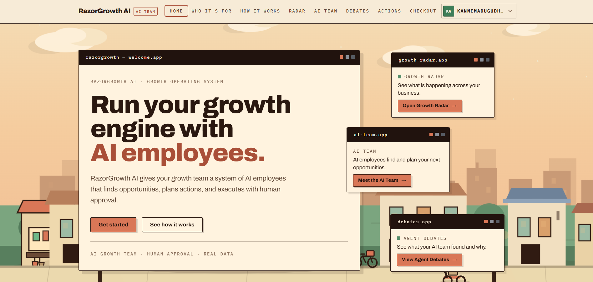

# RazorGrowth AI

**An AI growth team for Razorpay merchants — it detects revenue opportunities in your real business data, explains why, and asks your permission before acting.**



RazorGrowth AI ingests a merchant's real Razorpay TEST-mode commerce data (payments, orders, customers, products), runs a team of 13 specialised AI agents over it, surfaces growth opportunities with evidence, and turns the strongest ones into bounded, explainable, human-approved actions — with a full audit trail on every step. It also includes an **AI Buyer checkout**: an AI buyer reads the merchant catalog and completes a genuine Razorpay TEST purchase end to end.

> **Hackathon track:** AI Growth & Agentic Commerce — *grow the merchant's revenue, and make them sellable to AI buyers.*

---

## What is RazorGrowth AI?

Most small merchants drown in payment dashboards but starve for decisions. RazorGrowth AI is the missing layer: it turns raw commerce data into plain-English answers — *what is happening, why it matters, what to do next* — and only a human can approve the doing.

Every number shown in the product is real. Every money-touching action is:

- **Explainable** — why it was recommended, the evidence behind it, who/what it affects
- **Bounded** — explicit will-do / will-not-do scope, amount limits enforced by guardrails
- **Gated** — agents can propose; only the merchant owner/admin can approve
- **Audited** — an immutable event trail records every step from proposal to result

## The Problem

Merchants on Razorpay have real data — successful payments, failed payments, repeat customers, product catalogs — but no systematic way to detect and act on revenue opportunities. Generic AI dashboards show charts; they don't decide, they don't take responsibility, and they can't safely touch money.

## Our Solution

RazorGrowth AI combines a **Growth Radar** (signal detection over real payment data), an **AI Growth Team** (13 specialised agents that investigate like employees), an **Agent Debate** (agents cross-examine each other's findings), a **Growth Actions console** (explain → approve → execute → audit), and an **AI Buyer checkout** (the merchant becomes transactable by an AI buyer end to end).

## Growth Radar

The Radar reads real Razorpay TEST data and answers *"what is happening in my business?"* in one screen: revenue captured, transactions, customers, orders, average order value, failed payments — followed by a plain-English business summary generated from that data, detected growth signals ranked by confidence, and the priority opportunity.

```
REAL RAZORPAY TEST DATA
   ↓
Growth Radar detects signals (revenue change, repeat-purchase decline,
payment failures, dormant customers)
   ↓
Each signal → why it matters · evidence · opportunity · suggested action
```

## AI Team

13 specialised agents — Growth Manager, Product, Marketing, Campaign Strategist, Payment Recovery, Revenue Optimization, Customer Intelligence, Design/UX, Technology, Knowledge, Experimentation, Growth Memory, and Synthesis — execute a collaborative pipeline over the merchant's real data:

```
REAL MERCHANT DATA → AI AGENTS → ANALYSIS → FINDINGS
        → OPPORTUNITIES (ranked, with confidence + expected revenue)
        → RECOMMENDATIONS → HUMAN APPROVAL
```

Agents hold a capability model that **forbids** them from approving actions, bypassing guardrails, or sending money. They can only propose.

## Agent Debate

Before a recommendation becomes an action, specialist agents debate it across structured rounds: positions, counter-positions, findings classified as supporting/opposing/uncertainty, and a final synthesis. The merchant watches the conversation like a board meeting — and a **Groq-powered AI Assistant** answers questions about any debate ("why was this recommended?", "which agent contributed?", "what should I do next?") using only that debate's context.

## Agentic Commerce / Checkout

The AI Buyer flow makes the merchant transactable by an AI buyer, end to end:

```
AI BUYER reads the merchant catalog (name, description, price, availability)
   ↓
SELECTS a real product
   ↓
CREATES ORDER via the existing checkout API
   ↓
RAZORPAY TEST CHECKOUT opens
   ↓
PAYMENT RESULT — success verified server-side,
failure handled gracefully (safe state, no fake results, retry available)
```

Use test card `4100 2800 0000 1007` (any future expiry, any CVV) for success; a declined test card demonstrates the graceful failure state honestly.

## Real Razorpay TEST Data

This project runs on a **real Razorpay TEST-mode integration** (`RAZORPAY_ENABLED=true` + `RAZORPAY_TEST_MODE=true` + `REAL_TEST_INTEGRATION_ENABLED=true`). Orders are genuinely created on Razorpay TEST endpoints and ingested back into the local database. No real money moves. No demo numbers are fabricated — if data is missing, the UI shows an honest empty state.

## Human Approval & Safety

```
AI Team detects an opportunity
   ↓
Action prepared (explainable + bounded: scope, amount, will-do / will-not-do)
   ↓
WAITING FOR HUMAN APPROVAL  ← agents cannot approve; owner/admin only
   ↓
Merchant approves or rejects
   ↓
Approved action executes behind double guardrails
   ↓
Immutable audit trail records every step
   ↓
Failure? Safe state, no unauthorized money action, recovery path shown
```

Guardrails include per-action amount ceilings, campaign audience limits, discount percentage caps, idempotent execution (no accidental double-runs), and a global execution kill switch.

## Key Features

- **Growth Radar** — real-data business health, signals ranked by confidence, priority opportunity
- **AI Growth Team** — 13 specialised agents executing a collaborative analysis pipeline
- **Agent Debate** — multi-agent cross-examination with a Groq-powered Q&A assistant
- **Growth Actions console** — explainable, bounded, human-approved actions with execution results
- **Audit trail** — merchant-friendly timeline of every step (AI / YOU / SYS markers)
- **AI Buyer checkout** — catalog → order → Razorpay TEST payment → honest result handling
- **Auth & multi-tenancy** — JWT login, merchant-scoped roles (owner/admin/operator/analyst), strict tenant isolation
- **Security** — rate limiting, CORS/trusted hosts, secret-safe log redaction, HMAC-SHA256 webhook validation

## System Architecture

```
┌────────────────────────────────────────────────────────────────┐
│  FRONTEND  React 19 + TypeScript + Vite                        │
│  Home · Login · Growth Radar · AI Team · Debates ·              │
│  Growth Actions · AI Buyer Checkout · Profile                  │
└───────────────────────────┬────────────────────────────────────┘
                            │ /api (REST, JWT)
┌───────────────────────────▼────────────────────────────────────┐
│  BACKEND  FastAPI + SQLAlchemy                                  │
│  ┌──────────────┐  ┌───────────────┐  ┌──────────────────────┐ │
│  │ Growth Radar │  │ 13 AI Agents  │  │ Opportunity Engine   │ │
│  │ (signals)    │  │ + Debate      │  │ (scoring, ranking)   │ │
│  └──────────────┘  └───────┬───────┘  └──────────────────────┘ │
│  ┌──────────────────────────▼─────────────────────────────────┐ │
│  │ Action layer: guardrails → approval gate → executors        │ │
│  │               + immutable audit events                       │ │
│  └──────────────────────────┬─────────────────────────────────┘ │
│  ┌──────────────────────────▼─────────────────────────────────┐ │
│  │ LLM (Groq / OpenAI) · RAG knowledge store (pgvector)        │ │
│  └─────────────────────────────────────────────────────────────┘ │
└───────┬──────────────────────────────────────────┬───────────────┘
        │                                          │
   ┌────▼───────────┐                    ┌─────────▼──────────┐
   │ PostgreSQL 16   │                    │ Razorpay TEST APIs  │
   │ + pgvector      │                    │ (orders · payments  │
   │ (Docker)        │                    │  · customers)       │
   └────────────────┘                    └─────────────────────┘
```

## Tech Stack

| Layer | Technologies |
|---|---|
| Frontend | React 19, TypeScript 5.7, Vite 6 |
| Backend | FastAPI, SQLAlchemy 2.0, Alembic, Pydantic v2 |
| Database | PostgreSQL 16 + pgvector (Docker) |
| Payments | Razorpay TEST-mode SDK (Python) |
| AI | Groq (LLM provider), OpenAI embeddings, RAG pipeline |
| Auth | JWT (PyJWT), scrypt hashing, role-based multi-tenancy |

## Project Structure

```
RazorGrowth AI/
├── backend/
│   ├── app/
│   │   ├── agents/          # 13 specialised AI agents
│   │   ├── api/routes/      # REST endpoints (actions, debate, radar, payments, ...)
│   │   ├── core/            # config, security, middleware, logging
│   │   ├── data/            # deterministic seed + catalog provisioning
│   │   ├── integrations/    # Razorpay client (TEST mode boundary)
│   │   ├── models/          # SQLAlchemy models
│   │   ├── schemas/         # Pydantic contracts
│   │   └── services/        # business logic (radar, actions, executors, ...)
│   └── migrations/          # Alembic versions
├── frontend/
│   └── src/
│       ├── components/      # WindowPanel, buttons, header
│       ├── pages/           # Home, GrowthRadar, AgentsPage, DebatePage,
│       │                    # ActionsPage, Checkout, Login, Profile
│       ├── features/public/ # Marketing sections + Agent Debate UI
│       ├── lib/             # typed API client, auth context
│       └── styles/          # design tokens (cream/ink/terracotta system)
├── tests/                   # pytest suites (radar, analytics, e2e, security)
├── docs/                    # PHASE_5.md, PHASE_6.md
├── docker-compose.yml       # PostgreSQL + pgvector
├── requirements.txt
└── .env.example             # configuration template (no secrets)
```

## Getting Started

### Prerequisites

- Python 3.11+
- Node.js 18+
- Docker (for PostgreSQL)

### 1. Clone the repository

```bash
git clone https://github.com/<your-username>/razorgrowth-ai.git
cd razorgrowth-ai
```

### 2. Start PostgreSQL (pgvector)

```bash
docker compose up -d
```

### 3. Install backend dependencies

```bash
pip install -r requirements.txt
```

### 4. Configure environment variables

```bash
cp .env.example .env
```

Edit `.env` and fill in the values marked as required:

- `DATABASE_URL` — defaults to the Docker PostgreSQL instance
- `AUTH_SECRET_KEY` — generate: `python -c "import secrets; print(secrets.token_urlsafe(48))"`
- Razorpay TEST credentials from your [Razorpay dashboard](https://dashboard.razorpay.com/) (TEST mode → API keys): `RAZORPAY_KEY_ID`, `RAZORPAY_KEY_SECRET`, plus `RAZORPAY_ENABLED=true`, `RAZORPAY_TEST_MODE=true`, `REAL_TEST_INTEGRATION_ENABLED=true`
- `LLM_PROVIDER=groq` and `GROQ_API_KEY` (from [console.groq.com](https://console.groq.com)) for the AI agents and the debate assistant

### 5. Run database migrations

```bash
alembic upgrade head
```

### 6. Start the backend

```bash
uvicorn backend.app.main:app --host 127.0.0.1 --port 8001
```

### 7. Install frontend dependencies

```bash
cd frontend
npm install
```

### 8. Start the frontend

```bash
npm run dev
```

Open **http://localhost:5173** — the Vite dev server proxies `/api` to the backend on port 8001.

### 9. Create your account

Sign up at `/login`, then bootstrap your user as a merchant owner:

```bash
python -m backend.app.data.bootstrap_admin --email <your-email> --merchant <merchant-id-or-empty>
```

The first merchant sync happens automatically when you open Growth Radar — real Razorpay TEST data (orders, payments, customers) is ingested into your workspace.

## Environment Variables

Variable **names only** — never commit real values. See `.env.example` for the full annotated template.

| Variable | Purpose |
|---|---|
| `DATABASE_URL` | PostgreSQL connection string |
| `AUTH_SECRET_KEY` | JWT signing key (≥ 32 chars) |
| `AUTH_MODE` | `required` (secure) or `optional` (development) |
| `CORS_ORIGINS` | Allowed browser origins |
| `RAZORPAY_KEY_ID` / `RAZORPAY_KEY_SECRET` | Razorpay TEST credentials |
| `RAZORPAY_ENABLED` / `RAZORPAY_TEST_MODE` / `REAL_TEST_INTEGRATION_ENABLED` | Razorpay TEST-mode switches |
| `RAZORPAY_WEBHOOK_SECRET` | Webhook signature validation |
| `EXECUTION_ENABLED` | Global action-execution kill switch |
| `GUARDRAIL_MAX_AMOUNT_INR` / `GUARDRAIL_REQUIRE_APPROVAL` | Money-action guardrails |
| `LLM_PROVIDER` / `LLM_API_KEY` / `LLM_MODEL` | Primary LLM provider |
| `GROQ_API_KEY` / `GROQ_MODEL` | Groq configuration |
| `CAMPAIGN_MAX_TARGET` / `DISCOUNT_MAX_PERCENTAGE` / `DISCOUNT_MAX_AMOUNT_INR` | Campaign & discount limits |

## Testing

```bash
# Full backend suite
pytest

# Specific suites
pytest tests/test_phase5_radar_intel.py   # Growth Radar detection
pytest tests/test_analytics_data.py      # analytics against real data
pytest tests/test_e2e_integration.py     # end-to-end flows

# Frontend typecheck + production build
cd frontend
npm run build
```

## Hackathon Track — AI Growth & Agentic Commerce

**"Grow the merchant's revenue, and make them sellable to AI buyers."** Here is exactly how RazorGrowth AI addresses it — every claim backed by shipped functionality:

| Track requirement | Where it exists in this project |
|---|---|
| Merchant revenue growth | Growth Radar detects signals; Opportunity Engine ranks upsell, cross-sell, campaign, and payment-recovery opportunities with confidence and expected revenue |
| Razorpay TEST data | Real TEST-mode integration — orders created and verified on Razorpay TEST endpoints, data ingested back into the merchant workspace |
| AI agents | 13 specialised agents with a capability/permission model, running a collaborative investigation pipeline |
| Upsell & cross-sell | Product Agent finds cross-sell/upsell opportunities from real order history (e.g. accessory under-purchased vs. product buyers) |
| Payment recovery | Payment Recovery Agent detects failed payments and proposes a bounded retry action for the highest-value failure |
| Campaign opportunities | Campaign Strategist proposes campaigns (audience, type, expected impact) through the same action workflow |
| Agentic workflows | Full loop: detect → analyse → debate → propose → approve → execute → measure |
| Human approval | Growth Actions console — approve/reject restricted to merchant owner/admin; agents structurally cannot approve |
| Explainable actions | Every action shows why, evidence, scope, amount, and explicit will-do / will-not-do boundaries |
| Graceful failure handling | AI Buyer checkout shows an honest failure state (what happened, no money captured, safe system response, retry path); action execution failures persist a safe-state audit event |
| Audit trail | Per-action timeline of every step with real timestamps, rendered in merchant language |
| AI buyer commerce | AI Buyer reads the real catalog, selects a product, creates an order at its real price, and completes a Razorpay TEST payment |

## Demo Flow

A 10-minute judge walkthrough:

1. **Login** at `/login` (or sign up) — JWT auth, merchant workspace resolves
2. **Growth Radar** — real TEST data: revenue, transactions, failed payments, detected signals
3. **Start AI Team analysis** from the Radar — watch the 13-agent pipeline execute
4. **Review findings & opportunities** — ranked with confidence, expected revenue, and evidence
5. **Agent Debate** — open a debate, read the cross-examination, ask the Groq AI Assistant a question
6. **Growth Actions** — see the prepared action: why, evidence, scope, boundaries, amount
7. **Approve → Run** — execute the approved action and view the audit trail
8. **Checkout** — AI Buyer: select a real product, create the order (real Razorpay TEST order ID), pay with test card `4100 2800 0000 1007`
9. **Failure demo** — dismiss the payment window or use a declined test card: the safe failure state appears (no money captured, retry available)

## Screenshots

<p align="center">
  
</p>

The warm cream editorial design system — dark brown typography, terracotta accents, terminal-inspired window panels — carries through every dashboard.

## Future Improvements

- Live Razorpay execution path (currently refused honestly behind feature flags)
- Multi-merchant marketplace view for agencies
- Automated A/B experiment measurement on executed campaigns
- Streaming agent activity during debate rounds

## License

[MIT](LICENSE) — Copyright (c) 2026 DHEERAJ
